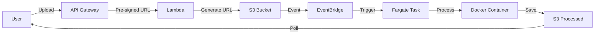

# 🎧 SurroundYou - Cloud-Native 8D Audio Processing Platform

> Enterprise-grade serverless audio processing pipeline leveraging AWS-managed services for scalable, event-driven 8D audio transformation

[](https://aws.amazon.com/)
[](https://www.docker.com/)
[](https://reactjs.org/)
[](https://www.python.org/)

**[🚀 Live Demo](https://main.d3pqqc4w1tm533.amplifyapp.com/)** | **[📝 Technical Blog](https://www.linkedin.com/posts/xadi_aws-cloudcomputing-serverless-activity-7388656205344391168-vEMi)**

---

## 📋 Table of Contents

- [Overview](#-overview)
- [Architecture](#-architecture--system-design)
- [Technology Stack](#-technology-stack)
- [Technical Challenges](#-technical-challenges--solutions)
- [Performance Metrics](#-performance--cost-metrics)
- [Key Learnings](#-key-learnings)
- [Contact](#-connect-with-me)

---

## 🎯 Overview

SurroundYou is a production-ready, cloud-native audio processing platform that transforms stereo audio into immersive 8D spatial audio experiences. The project demonstrates advanced cloud architecture patterns, containerization strategies, and distributed systems design principles.

### Business Value
- **Cost-Efficient:** Under **$1 per 1,000 conversions** with AWS serverless architecture
- **Scalable:** Auto-scales from zero to hundreds of concurrent processing tasks
- **Reliable:** Decoupled event-driven design ensures fault tolerance
- **Secure:** Pre-signed URLs, IAM-enforced least-privilege access, and encrypted storage

### Technical Highlights
- Fully containerized processing pipeline on AWS Fargate
- Event-driven architecture with Amazon EventBridge
- Zero-maintenance serverless compute
- Direct browser-to-S3 uploads (no server bottleneck)

---

## 🏗️ Architecture & System Design

### High-Level Architecture

<div align="center">


*Event-driven serverless architecture leveraging AWS managed services*

</div>

The platform implements a **loosely-coupled, event-driven microservices architecture** optimized for scalability and cost efficiency.

**[View Interactive Architecture Diagram →](https://lucid.app/lucidchart/5b01e82b-cbf1-42ae-a722-8bcdffeeb5cb/edit?viewport_loc=-718%2C-178%2C2860%2C1175%2C0_0&invitationId=inv_9a3b2110-38a5-4215-806b-d29cf94e9360)**

### Request Flow



<div align="center">


</div>

### Component Breakdown

#### 1. **Frontend Layer** (React + Amplify)

<div align="center">


</div>

- Single-page application with responsive UI
- Direct S3 uploads via pre-signed URLs (bypasses server limits)
- Polling mechanism for async processing status
- Client-side error handling and retry logic

#### 2. **API Gateway Layer** (Lambda Functions)

<div align="center">


</div>

- **Upload Endpoint:** Generates time-limited S3 pre-signed URLs
- **Download Endpoint:** Provides secure access to processed files
- **Validation:** Input sanitization and file type verification
- Fully managed, auto-scaling API infrastructure

#### 3. **Event Processing Layer** (EventBridge)

<div align="center">


</div>

- Captures S3 `ObjectCreated` events in real-time
- Routes events to appropriate compute targets
- Dead-letter queue (DLQ) for failed event capture and debugging
- Enables future extensibility (SNS notifications, analytics, etc.)

#### 4. **Compute Layer** (AWS Fargate on ECS)

<div align="center">


</div>

- **Serverless containers:** No EC2 instance management required
- **On-demand execution:** Tasks spin up only when triggered
- **Resource optimization:** Allocated CPU/memory per task definition
- **Platform isolation:** Linux containers ensure consistent runtime

#### 5. **Processing Pipeline** (Dockerized Python Application)

**Core Dependencies:**
- `boto3` - AWS SDK for S3 interactions
- `numpy` - High-performance numerical computations
- `scipy` - Digital signal processing algorithms
- `pydub` - Audio format conversion and manipulation
- `pedalboard` - Professional-grade audio effects processing
- `ffmpeg` - Audio codec handling

**Processing Steps:**
1. Download source file from S3
2. Convert to WAV format for processing
3. Apply 8D spatial audio transformation (binaural panning + HRTF simulation)
4. Encode to MP3 with optimized bitrate
5. Upload processed file to S3 `processed/` prefix
6. Cleanup temporary files and terminate

#### 6. **Storage Layer** (Amazon S3)

<div align="center">


</div>

- **Source bucket:** User uploads with lifecycle policies
- **Processed bucket:** Output files with presigned download access
- **Encryption:** Server-side encryption (SSE-S3) at rest
- **Versioning:** Optional version control for audit trails

#### 7. **Observability** (CloudWatch)

<div align="center">


</div>

- Container logs aggregation
- Task execution metrics
- Error tracking and alerting
- Performance monitoring dashboards

---

## 🛠️ Technology Stack

### Frontend
| Technology | Purpose |
|------------|---------|
| **React 18** | UI framework with hooks and context |
| **Vite** | Lightning-fast build tool and HMR dev server |
| **Tailwind CSS** | Utility-first styling framework |
| **AWS Amplify Gen 2** | Frontend deployment, API integration, hosting |

### Backend - API Layer
| Technology | Purpose |
|------------|---------|
| **AWS Lambda** | Serverless API handlers (Python 3.12 runtime) |
| **Amazon API Gateway** | RESTful API management and throttling |
| **AWS Amplify** | Infrastructure provisioning and CI/CD |

### Backend - Processing Pipeline
| Technology | Purpose |
|------------|---------|
| **Docker** | Container packaging and portability |
| **Amazon ECR** | Private container registry |
| **Amazon ECS** | Container orchestration |
| **AWS Fargate** | Serverless container compute |
| **Python 3.12** | Core processing logic |

#### Python Dependencies
```python
boto3==1.34.x          # AWS SDK
numpy==1.26.x          # Array operations
scipy==1.11.x          # Signal processing
pydub==0.25.x          # Audio manipulation
pedalboard==0.9.x      # Audio effects
ffmpeg-python          # Codec support
```

### Infrastructure & Security
| Technology | Purpose |
|------------|---------|
| **Amazon S3** | Object storage with encryption |
| **Amazon EventBridge** | Event bus and routing |
| **AWS IAM** | Fine-grained access control |
| **Amazon CloudWatch** | Logging, metrics, and alarms |

### Deployment Configuration

**Region:** `ap-south-1` (Mumbai, India)

**Amplify Build Configuration:**
```yaml
version: 1
backend:
  phases:
    preBuild:
      commands:
        - export LANG=C.UTF-8
        - export LC_ALL=C.UTF-8
        - export PATH="$HOME/.pyenv/bin:$PATH"
        - eval "$(pyenv init --path)"
        - eval "$(pyenv init -)"
        - pyenv install -s 3.12.0
        - pyenv global 3.12.0
        - python --version
        - pip install --upgrade pip
        - pip install pipenv
        - export PIPENV_PYTHON=$(pyenv which python)
    build:
      commands:
        - export LANG=C.UTF-8
        - export LC_ALL=C.UTF-8
        - export PATH="$HOME/.pyenv/bin:$PATH"
        - eval "$(pyenv init --path)"
        - eval "$(pyenv init -)"
        - export PIPENV_PYTHON=$(pyenv which python)
        - amplifyPush --simple
frontend:
  phases:
    preBuild:
      commands:
        - npm ci
    build:
      commands:
        - npm run build
  artifacts:
    baseDirectory: dist
    files:
      - '**/*'
  cache:
    paths:
      - node_modules/**/*
      - $HOME/.pyenv/**/*
```

---

## 🔥 Technical Challenges & Solutions

### Challenge #1: Lambda Deployment Size Constraints
**Problem:** Initial Lambda-based design exceeded 250MB uncompressed limit due to scientific libraries (`numpy`, `scipy`, `ffmpeg`).

**Solution:** 
- Migrated to containerized architecture on AWS Fargate
- Eliminated deployment size restrictions (up to 10GB container support)
- Maintained serverless benefits (no server provisioning)

**Impact:** Enabled use of full-featured audio processing libraries without compromises.

---

### Challenge #2: IAM Permission Chains
**Problem:** Complex multi-service permission requirements:
- EventBridge → ECS (`ecs:RunTask`)
- ECS Task → ECR (`ecr:GetAuthorizationToken`, `ecr:BatchGetImage`)
- ECS Task → S3 (`s3:GetObject`, `s3:PutObject`)
- EventBridge → ECS (`iam:PassRole` for task and execution roles)

**Solution:**
- Separated **Task Role** (application permissions) from **Execution Role** (infrastructure permissions)
- Configured EventBridge with `iam:PassRole` for both roles
- Implemented least-privilege policies with explicit resource ARNs

**Impact:** Secure, auditable permission model following AWS best practices.

---

### Challenge #3: Cross-Platform Docker Compatibility
**Problem:** Docker image built on Windows (ARM64 architecture) failed on Linux Fargate runtime.

**Error:**
```
exec /usr/local/bin/python: exec format error
```

**Solution:**
```bash
docker build --platform linux/amd64 -t surroundyou:latest .
```

**Impact:** Ensured consistent runtime behavior across development and production environments.

---

### Challenge #4: Silent Event Processing Failures
**Problem:** Fargate tasks weren't launching; EventBridge showed "Invoked" but no CloudWatch logs appeared.

**Root Cause:** EventBridge couldn't pass IAM roles to ECS due to missing `iam:PassRole` permission.

**Solution:**
- Configured Dead-Letter Queue (DLQ) on EventBridge rule
- Inspected failed events in SQS for detailed error messages
- Added missing `iam:PassRole` for both `TaskRoleArn` and `ExecutionRoleArn`

**Impact:** Reduced debugging time from hours to minutes with proper error visibility.

---

### Challenge #5: Amplify Build Environment Conflicts
**Problem:** API deployment failed with Python runtime mismatches and Amazon Linux version conflicts.

**Solution:**
- Implemented explicit Python 3.12 installation via pyenv
- Set UTF-8 locale configuration for consistent builds
- Cached pyenv installation across builds for faster deployment
- Configured pipenv with explicit Python interpreter path

**Impact:** Consistent, reproducible builds across environments with zero runtime failures.

---

## 📊 Performance & Cost Metrics

### Processing Performance
| Metric | Value |
|--------|-------|
| **Average Processing Time** | 30-60 seconds per file |
| **Concurrent Tasks** | Auto-scales to 100+ (configurable) |
| **Task CPU** | 1 vCPU |
| **Task Memory** | 2 GB |
| **Cold Start Overhead** | ~15 seconds (ECR pull + container init) |
| **Deployment Region** | ap-south-1 (Mumbai) |

### Cost Analysis (ap-south-1 Region)
| Component | Cost per 1K Conversions |
|-----------|------------------------|
| **Lambda (API)** | ~$0.02 (2 invocations × 1K files) |
| **Fargate Tasks** | ~$0.68 (1 vCPU, 2GB, 45s avg) |
| **S3 Storage** | ~$0.11 (assumes 5MB avg file size) |
| **Data Transfer** | ~$0.09 (ingress free, egress charged) |
| **EventBridge** | ~$0.01 |
| **API Gateway** | ~$0.04 |
| **CloudWatch Logs** | ~$0.03 |
| **Total** | **~$0.98 per 1,000 conversions** |

**Key Insight:** Under **$1 per 1,000 conversions** demonstrates cost-effective architecture design.

*Pricing based on ap-south-1 (Mumbai) region. Actual costs vary by usage patterns and regional pricing.*

### Scalability
- **Vertical:** Task size adjustable (0.25 vCPU - 4 vCPU)
- **Horizontal:** ECS service scales from 0 to cluster limits
- **Storage:** S3 scales infinitely with no provisioning

---

## 🎓 Key Learnings

### Cloud Architecture Principles
- **Decoupling services** reduces blast radius and improves maintainability
- **Event-driven patterns** enable async workflows and better scalability
- **Managed services** (Fargate, Lambda) reduce operational overhead significantly
- **Right-sizing compute** (Lambda vs Fargate) based on workload characteristics

### AWS-Specific Insights
- **IAM debugging** requires understanding Task Role vs Execution Role semantics
- **EventBridge DLQs** are critical for debugging distributed event flows
- **Regional pricing** impacts total cost - ap-south-1 provides cost advantages
- **Container platforms** matter: Always specify `--platform linux/amd64` for Fargate

### DevOps Best Practices
- **Build reproducibility** through explicit runtime versioning (Python 3.12.0 via pyenv)
- **Logging strategies** must be planned upfront (CloudWatch Logs retention, filtering)
- **Error handling** at every layer: network, permissions, runtime
- **Cost monitoring** should be baked into architecture decisions early

### Real-World Engineering
- **Pivot decisively** when constraints block progress (Lambda → Fargate)
- **Debug systematically** using AWS service integration points (DLQs, CloudWatch Insights)
- **Document assumptions** about IAM, networking, and service limits
- **Test cross-platform** builds before production deployment

---

## 📈 Project Impact

This project demonstrates:

✅ **Production-ready architecture** - Not a toy project; built with real-world constraints in mind  
✅ **Cost awareness** - Sub-$1 per 1K conversions shows understanding of cloud economics  
✅ **Problem-solving** - Pivoted from Lambda to Fargate when faced with technical limitations  
✅ **Security-first design** - IAM least-privilege, encryption at rest, pre-signed URLs  
✅ **Operational excellence** - Logging, error handling, DLQs for debugging  

---

## 📧 Connect With Me

**Aditya Waghmare**  
Cloud Solutions Architect | AWS Enthusiast | Backend Engineer

[](https://www.linkedin.com/in/xadi)
[](mailto:adityawaghmarex@gmail.com)

💬 **Open to discussing:**
- Cloud architecture patterns
- AWS best practices
- Serverless design strategies
- Containerization and orchestration

---

## ⭐ Show Your Support

If this project helped you understand event-driven architectures, AWS services, or gave you ideas for your own cloud applications, please consider starring the repository!

---

<div align="center">

**Built with ☕, AWS CloudWatch logs, IAM debugging, and a passion for scalable systems**

*"The best architecture is the one that solves real problems, not the one that uses the most services."*

</div>
