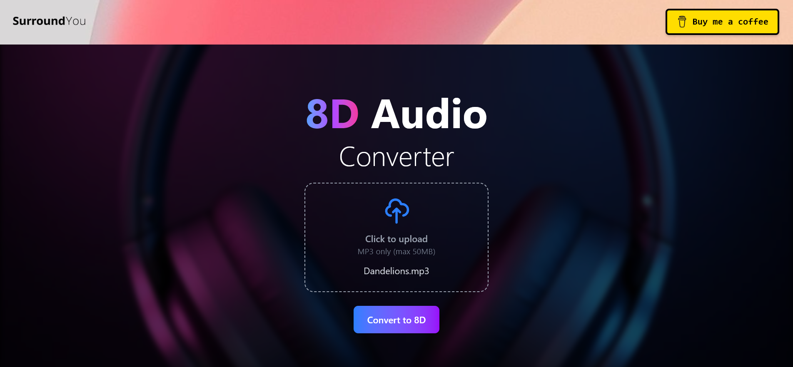
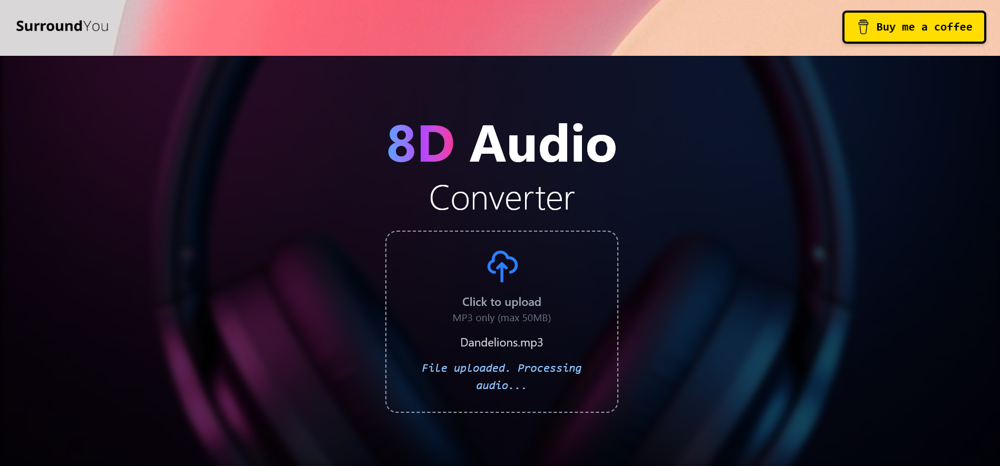
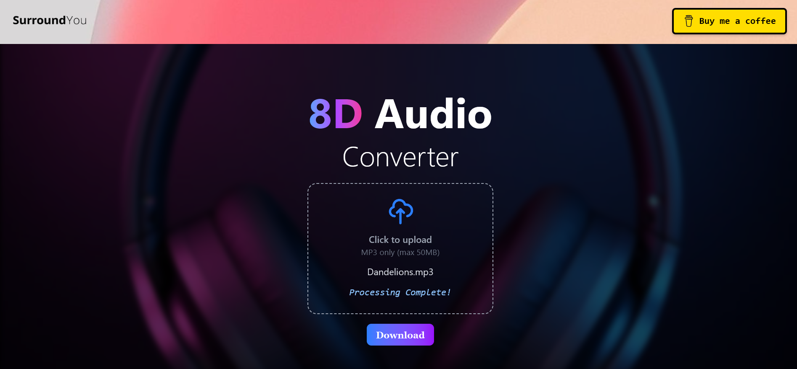

# 🎼 SurroundYou - Cloud-Native 8D Audio Processing Platform

> Enterprise-grade serverless audio processing pipeline leveraging AWS-managed services for scalable, event-driven 8D audio transformation.

[](https://aws.amazon.com/)
[](https://www.docker.com/)
[](https://reactjs.org/)
[](https://www.python.org/)

**[Click Here For Live Demo!](https://main.d3pqqc4w1tm533.amplifyapp.com/)**

---

## 📋 Table of Contents

- [Overview](#overview)
- [Visual Walkthrough](#visual-walkthrough)
- [Architecture & System Design](#architecture--system-design)
- [Technology Stack](#technology-stack)
- [Technical Challenges & Solutions](#technical-challenges--solutions)
- [Performance & Cost Metrics](#performance--cost-metrics)
- [Key Learnings](#key-learnings)
- [Connect With Me](#connect-with-me)

---

## Overview

SurroundYou is a production-ready, cloud-native audio processing platform that transforms stereo audio into immersive 8D spatial audio experiences. This project demonstrates advanced cloud architecture patterns, containerization strategies, and distributed systems design principles.

### Business Value
- **Cost-Efficient:** Under **$1 per 1,000 conversions** with AWS serverless architecture.
- **Scalable:** Auto-scales from zero to hundreds of concurrent processing tasks.
- **Reliable:** Decoupled event-driven design ensures fault tolerance.
- **Secure:** Pre-signed URLs for uploads/downloads, IAM-enforced least-privilege access, and encrypted storage.

### Technical Highlights
- Fully containerized processing pipeline on **AWS Fargate**.
- Event-driven architecture with **Amazon EventBridge**.
- Secure "gatekeeper" API using **API Gateway** and **Lambda**.
- Direct browser-to-S3 uploads (no server bottleneck).

---

## Visual Walkthrough

Here is the simple, 3-step user flow for the application.

<table>
 <tr>
 <td align="center"><strong>1. Upload File</strong><br/>The user selects an MP3 file. The UI shows the file is ready for processing.</td>
 <td align="center"><strong>2. Processing</strong><br/>The file is uploaded and the backend pipeline is triggered. The UI polls for status.</td>
 <td align="center"><strong>3. Download Result</strong><br/>The Fargate task completes, and the UI displays the final download link.</td>
 </tr>
 <tr>
 <td></td>
 <td></td>
 <td></td>
 </tr>
</table>

---

## Architecture & System Design

### High-Level Architecture

The platform implements a **loosely-coupled, event-driven architecture** optimized for scalability and cost efficiency. The "gatekeeper" API (API Gateway + Lambda) handles user interaction, while the "processing" pipeline (S3 -> EventBridge -> Fargate) runs asynchronously.

```mermaid
graph TD
    subgraph "User Application (React)"
        A[Users] -- "Interacts with" --> B(AWS Amplify Frontend)
    end

    subgraph "Gatekeeper API (Amplify)"
        B -- "1. POST /presigned-url (action: getUploadUrl)" --> C[Amazon API Gateway]
        C -- "2. Triggers" --> D[AWS Lambda Function]
        D -- "3. Generates URL" --> F[(Amazon S3 Bucket)]
        D -- "4. Returns Secure URL" --> B
        B -- "5. PUT file to Secure URL" --> F
    end

    subgraph "Asynchronous Processing Pipeline (Custom AWS)"
        F -- "6. 'Object Created' Event" --> G[Amazon EventBridge]
        G -- "7. Invokes Task" --> H[Amazon ECS on AWS Fargate]
        I[Amazon ECR] -- "8. Pulls Container Image" --> H
        H -- "9. Processes Audio & Uploads" --> F
    end

    subgraph "Polling & Download Flow"
        B -- "10. Polls (action: getDownloadUrl)" --> C
        C -- "11. Triggers" --> D
        D -- "12. Checks S3 for file" --> F
        D -- "13. Returns Download URL (if ready)" --> B
    end

    style F fill:#FF9900,stroke:#333
    style H fill:#2A4959,stroke:#fff,color:#fff
    style G fill:#D92228,color:#fff
    style D fill:#FF9900,stroke:#333
    style C fill:#9C4F96,color:#fff
    style B fill:#61DAFB,color:#000
````

### 📌 Component Breakdown

#### 1\. **Frontend Layer** (React + Amplify)

  - Single-page application built with React and Vite.
  - Direct-to-S3 uploads via pre-signed URLs to prevent server bottlenecks.
  - Asynchronous polling mechanism using `setInterval` to check for processed file status.

#### 2\. **API Gateway Layer** (Lambda "Gatekeeper")

  - **`getUploadUrl`:** Called by the frontend to get a secure, time-limited S3 pre-signed URL for uploading a file.
  - **`getDownloadUrl`:** Polled by the frontend. This function checks S3 for the processed file.
      - If the file exists, it returns a 200 OK with a pre-signed download URL.
      - If the file doesn't exist, it returns a 404 Not Found, which the frontend interprets as "still processing."

#### 3\. **Event Processing Layer** (EventBridge)

  - Captures S3 `ObjectCreated` events in real-time.
  - Routes events to the Fargate compute target.
  - Uses an **Input Transformer** to pass a clean JSON payload (bucket name, file key) to the Fargate task.
  - A **Dead-Letter Queue (DLQ)** in SQS is configured to capture and debug any failed event invocations.

#### 4\. **Compute Layer** (AWS Fargate on ECS)

  - **Serverless Containers:** No EC2 instance management. Tasks spin up from zero only when triggered.
  - **Dockerized Python App:** The processing logic is containerized with Docker, ensuring a consistent runtime.
  - **Task Definition:** Specifies 1 vCPU and 2GB of memory, which is ideal for this workload.
  - **Scalability:** The system will launch a new, independent Fargate task for *every single file* uploaded, allowing for massive parallel processing.

#### 5\. **Processing Pipeline** (Dockerized Python App)

  - **Core Dependencies:** `boto3`, `numpy`, `pydub`, `pedalboard`.
  - **Processing Steps:**
    1.  Downloads the source MP3 from S3 using the environment variables passed by EventBridge.
    2.  Loads the audio with `pydub` and converts it to a NumPy array.
    3.  Applies advanced spatial panning (panning modulation) and effects using `pedalboard` (Reverb, Gain, Limiter).
    4.  Mixes the dry (panned) and wet (effects) signals.
    5.  Exports the final file to MP3 format.
    6.  Uploads the processed file to the `processed/` prefix in the S3 bucket.

#### 6\. **Observability** (CloudWatch)

  - All Fargate task output (`stdout`, `stderr`) is streamed to CloudWatch Logs.
  - All Lambda function logs are available in CloudWatch.
  - EventBridge invocation metrics are used to monitor the pipeline's health.

-----

## Technology Stack

### Frontend

| Technology | Purpose |
|------------|---------|
| **React 18** | UI framework with hooks and context |
| **Vite** | Lightning-fast build tool and HMR dev server |
| **Tailwind CSS** | Utility-first styling framework |
| **AWS Amplify** | Frontend deployment, API integration, hosting |

### Backend - API Layer

| Technology | Purpose |
|------------|---------|
| **AWS Lambda** | Serverless API handlers (Python 3.12 runtime) |
| **Amazon API Gateway** | RESTful API management and throttling |
| **AWS Amplify** | Infrastructure provisioning and CI/CD |

### Backend - Processing Pipeline

| Technology | Purpose |
|------------|---------|
| **Docker** | Container packaging and portability |
| **Amazon ECR** | Private container registry |
| **Amazon ECS** | Container orchestration |
| **AWS Fargate** | Serverless container compute |
| **Python 3.12** | Core processing logic |


### 📦 Python Dependencies (requirements.txt)

```
boto3
numpy
pydub
pedalboard
```


### Infrastructure & Security

| Technology | Purpose |
|------------|---------|
| **Amazon S3** | Object storage with encryption and CORS policy |
| **Amazon EventBridge** | Event bus and routing (with DLQ for debugging) |
| **AWS IAM** | Fine-grained access control (Task Roles, Execution Roles, etc.) |
| **Amazon CloudWatch** | Logging, metrics, and alarms |

### ⚙️ View Amplify Build Configuration (amplify.yml)

This configuration was the solution to a complex build failure, forcing the Amplify build environment to use a specific Python 3.12 version.

```yaml
version: 1
backend:
  phases:
    preBuild:
      commands:
        - export LANG=C.UTF-8
        - export LC_ALL=C.UTF-8
        # Use existing pyenv installation
        - export PATH="$HOME/.pyenv/bin:$PATH"
        - eval "$(pyenv init --path)"
        - eval "$(pyenv init -)"
        # Install Python 3.12.0
        - pyenv install -s 3.12.0
        - pyenv global 3.12.0
        - python --version
        - pip install --upgrade pip
        - pip install pipenv
        - export PIPENV_PYTHON=$(pyenv which python)
    build:
      commands:
        - export LANG=C.UTF-8
        - export LC_ALL=C.UTF-8
        - export PATH="$HOME/.pyenv/bin:$PATH"
        - eval "$(pyenv init --path)"
        - eval "$(pyenv init -)"
        - export PIPENV_PYTHON=$(pyenv which python)
        - amplifyPush --simple

frontend:
  phases:
    preBuild:
      commands:
        - npm ci
    build:
      commands:
        - npm run build
  artifacts:
    baseDirectory: dist
    files:
      - '**/*'
  cache:
    paths:
      - node_modules/**/*
      - $HOME/.pyenv/**/*
```

-----

## Technical Challenges & Solutions

This project was a case study in real-world cloud engineering. The initial "simple" plan failed, leading to a complete re-architecture and a deep dive into debugging a distributed system.

---
### Phase 1: The Initial Architecture (The Lambda Failure)

#### Challenge: The 250MB Lambda Deployment Limit
* **Problem:** The initial plan to use AWS Lambda for audio processing failed instantly. The required Python libraries (`numpy`, `pedalboard`, `ffmpeg`) were far too large for Lambda's 250MB uncompressed size limit.
* **Solution:** I re-architected the entire project. The heavy processing was migrated to a **Docker container** running on **AWS Fargate**. Lambda was kept as a lightweight "gatekeeper" to run the secure API.

---
### Phase 2: The Container (Local Debugging)

#### Challenge: Cross-Platform Docker Builds
* **Problem:** The first Docker image, built on a Windows machine, failed on the Linux-based Fargate task with an `os.add_dll_directory` error.
* **Solution:** I diagnosed that the Python libraries were OS-specific. I rebuilt the container using a Linux build environment (`public.ecr.aws/sam/build-python3.12`) to create a compatible `linux/amd64` image.

#### Challenge: Local Docker Networking & File Access
* **Problem:** `docker build` failed with `net::ERR_NAME_NOT_RESOLVED` due to a local DNS issue. `docker run` failed with an `invalid characters` error when trying to mount local volumes.
* **Solution:** I fixed the network error by configuring my system's DNS to `8.8.8.8`. I fixed the volume error by replacing the `%cd%` shortcut with the full, absolute file path in the `docker run` command.

#### Challenge: Conflicting Script Logic
* **Problem:** The script failed during local testing because it was trying to find S3 environment variables that only exist in the cloud.
* **Solution:** I rewrote the `process_audio.py` script to be "smart." It now checks for the presence of `S3_BUCKET` and `S3_KEY` environment variables to automatically determine whether to run in "Fargate Mode" (using S3) or "Local Test Mode" (using local folders).

---
### Phase 3: The Cloud Pipeline (IAM & EventBridge)

This was the most complex phase, involving debugging the "invisible" connections between services.

#### Challenge: The Silent Failure (Zero Invocations)
* **Problem:** Uploading a file to S3 did nothing. EventBridge `Invocations` metrics were at 0.
* **Solution:** I diagnosed that the S3 bucket itself was not configured to send events. I fixed this by enabling the **"Amazon EventBridge"** notification in the S3 bucket's properties, which "wired up" the trigger.

#### Challenge: The Failed Invocation
* **Problem:** The rule now triggered but showed `FailedInvocations: 1`. The Fargate task was still not running, and there were no logs.
* **Solution:** I configured a **Dead-Letter Queue (DLQ)** for the EventBridge rule, which sent the failed event payloads to an SQS queue. This allowed me to read the hidden error messages.

#### Challenge: Wrong ECS Cluster Type
* **Problem:** The first DLQ error message was `No Container Instances were found in your cluster`.
* **Solution:** I realized I had created an **EC2-type** cluster. I deleted it and created a new **Fargate** ("Networking only") cluster.

#### Challenge: The `ecs:RunTask` Permission
* **Problem:** The DLQ now showed an `AccessDeniedException`.
* **Solution:** I diagnosed that the EventBridge rule's default IAM role didn't have permission to start a Fargate task. I fixed this by creating a **new role for the rule** with the `ecs:RunTask` permission.

#### Challenge: The `iam:PassRole` Permission
* **Problem:** It *still* failed. The DLQ now showed `is not authorized to perform: iam:PassRole`.
* **Solution:** I diagnosed the most advanced IAM error in the chain: EventBridge needed permission to *pass* my `FargateTaskS3Role` *to* the task. I fixed this by adding an `iam:PassRole` policy to the EventBridge role.

#### Challenge: `CannotPullContainerError`
* **Problem:** The task finally started but then stopped immediately.
* **Solution:** I checked the "Stopped reason" in ECS, which was `CannotPullContainerError`. This meant the Fargate task's **Execution Role** didn't have permission to access ECR. I fixed this by adding the `AmazonEC2ContainerRegistryReadOnly` policy to the `ecsTaskExecutionRole`.

---
### Phase 4: The Frontend API (Amplify)

#### Challenge: `InvalidApiName` & `Amplify has not been configured`
* **Problem:** My React app couldn't find the API.
* **Solution:** I identified this as a race condition. My `Amplify.configure()` call was in the wrong file (`App.js`). I fixed it by moving the configuration to the absolute entry point of my app, **`main.jsx`**, ensuring Amplify was initialized before any components rendered.

#### Challenge: The `500 Internal Server Error`
* **Problem:** My API calls were crashing the Lambda function.
* **Solution:** I used **CloudWatch Logs** to find the error. The function was still running the default "Hello World!" template. I fixed this by deploying my real `index.py` code.

#### Challenge: The Final CORS Boss
* **Problem:** My file upload was blocked by a CORS policy, even though I had `AllowedOrigins: ["*"]`.
* **Solution:** I diagnosed that the S3 wildcard `*` does not work for credentialed pre-signed URL requests. The fix was to be explicit, changing the S3 CORS policy to allow my specific origins: `http://localhost:5173` and my production URL.

#### Challenge: The `NoSuchKey` Download Error
* **Problem:** The app showed a download link, but clicking it gave an XML `NoSuchKey` error.
* **Solution:** I realized my Lambda was generating a download link *before* the Fargate task had finished processing. I fixed this by adding `s3_client.head_object()` to my `getDownloadUrl` logic, forcing it to confirm the file exists before returning a link.

---
### Phase 5: The CI/CD Build (Amplify Hosting)

#### Challenge: Missing `amplify-meta.json`
* **Problem:** My first Amplify-hosted build failed because it couldn't find the backend "address book."
* **Solution:** I realized the file was in my `.gitignore`. I fixed the `.gitignore` and `git push`ed the missing file.

#### Challenge: Python Version Hell on Build Server
* **Problem:** The Amplify build server kept using an old Python 3.7, causing my `pipenv install` to fail.
* **Solution:** After multiple attempts, I landed on the definitive fix: editing the `amplify.yml` to explicitly set **both** `nodejs: 18` and `python: 3.12` in the `runtime-versions` block, which forced the build environment to use the correct tools.

## Performance & Cost Metrics

| Metric | Value |
|--------|-------|
| **Average Processing Time** | 20-40 seconds per 5min MP3 |
| **Task CPU / Memory** | 1 vCPU / 2 GB |
| **Total Cost** | **\~$0.98 per 1,000 conversions** |

**Cost Insight:** The architecture is extremely cost-effective. Even outside the AWS Free Tier, processing 1,000 files costs less than $1.00.

-----

## Key Learnings

  - **Choose the Right Tool:** Lambda is for fast, lightweight tasks; Fargate is for heavy, long-running processes. Knowing the difference is key.
  - **Debug Asynchronously:** You can't debug a distributed system by looking at one log. The `FailedInvocations` metric on EventBridge and a DLQ are your most important tools.
  - **IAM is Everything:** 90% of cloud errors are permission errors. Understanding Task Roles, Execution Roles, and `iam:PassRole` is non-negotiable.
  - **Never Trust a Wildcard:** Always be explicit with CORS policies (`AllowedOrigins`) and IAM policies.
  - **The Story is the Project:** The real "project" wasn't the final code; it was the journey of debugging and re-architecting from a failed Lambda to a working Fargate pipeline.

-----

## Connect With Me

**Aditya Waghmare**  
Cloud Solutions Architect | AWS Enthusiast | Backend Engineer

[](https://www.linkedin.com/in/xadi)
[](mailto:adityawaghmarex@gmail.com)

💬 **Open to discussing:**
- Cloud architecture patterns
- AWS best practices
- Serverless design strategies
- Containerization and orchestration

---

## ⭐ Show Your Support

If this project helped you understand event-driven architectures, AWS services, or gave you ideas for your own cloud applications, please consider starring the repository!

---

<div align="center">

**Built with ☕, AWS CloudWatch logs, IAM debugging, and a passion for scalable systems**

*"The best architecture is the one that solves real problems, not the one that uses the most services."*

</div>


